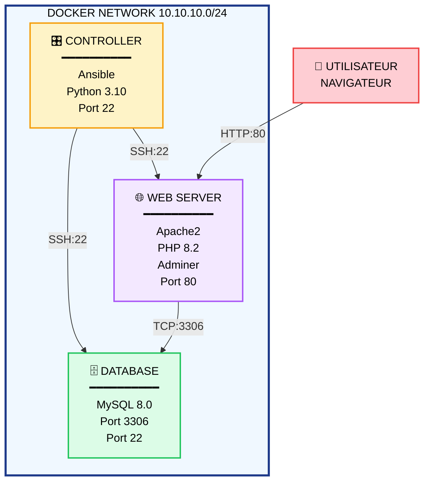
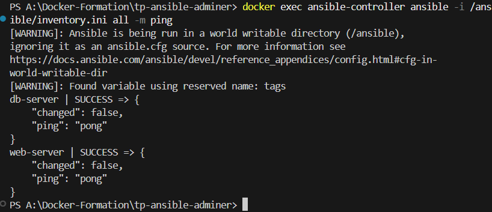
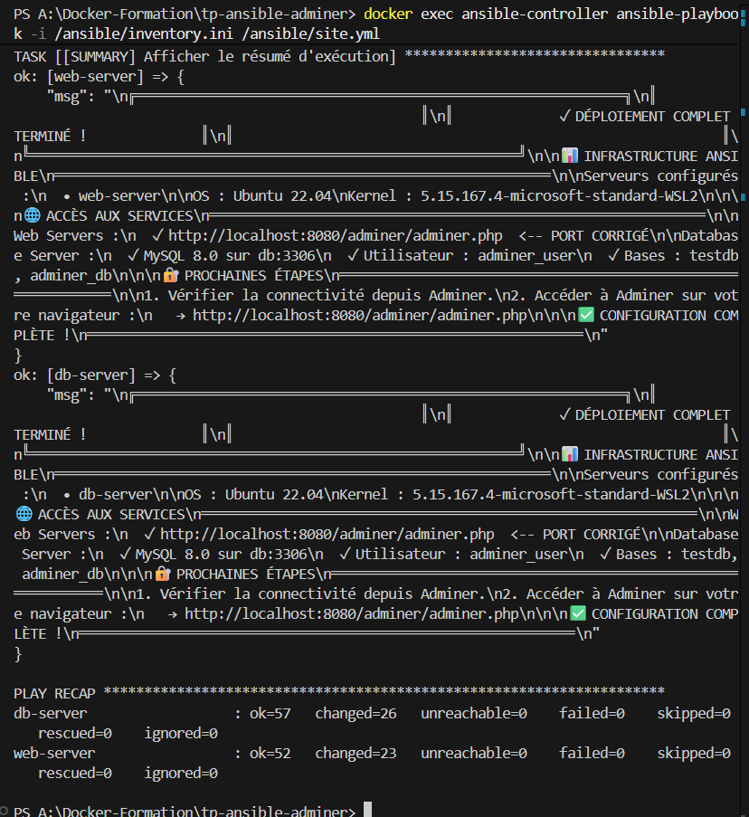
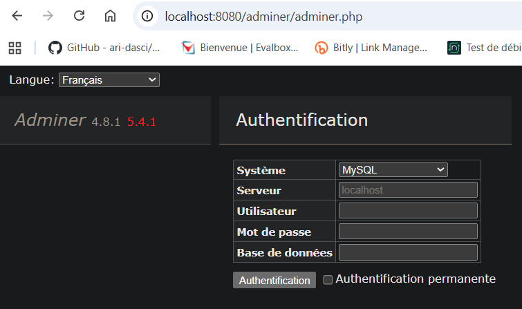
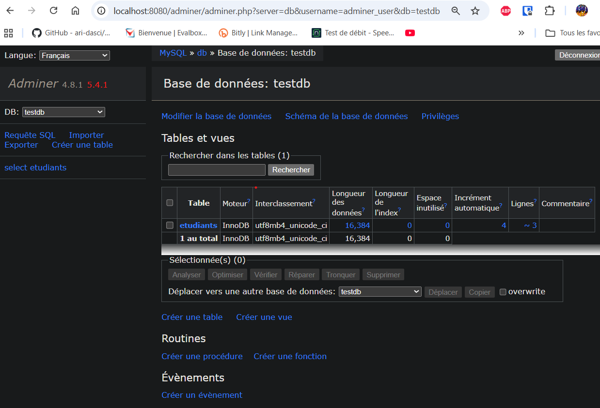
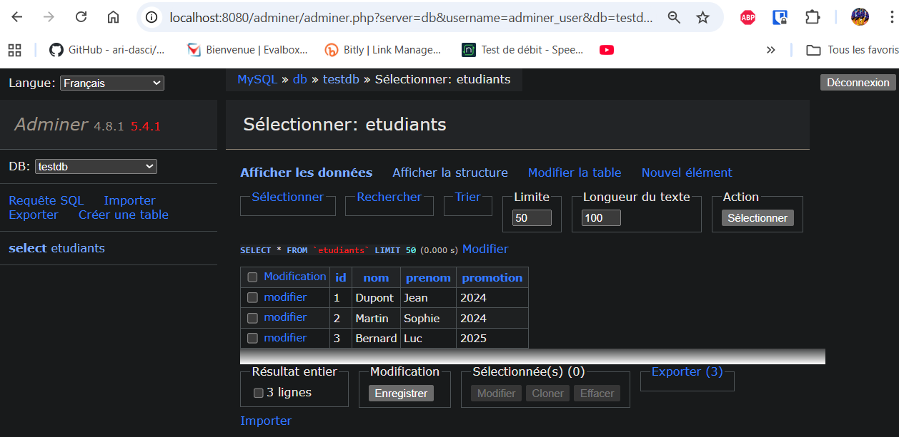
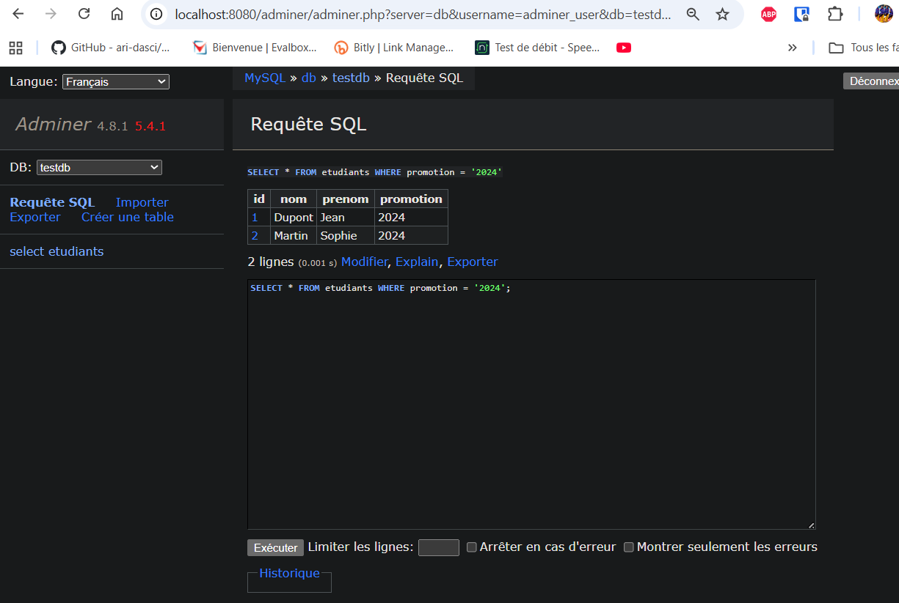

# TP Ansible - Déploiement d'Adminer sur Docker

## 📋 Informations du Projet

- **Étudiant** : FIENI Dannie Innocent Junior
- **Classe** : MCS 26.2 - Cybersécurité & Cloud Computing  
- **Date** : 31 Octobre 2025
- **GitHub** : https://github.com/JuFiSec
- **Repository** : https://github.com/JuFiSec/TP-Ansible-Adminer
- **Durée** : ~2 jours
- **Status** :  **SUCCÈS COMPLET**

---

## 📖 Description

Automatisation complète du déploiement d'une infrastructure de gestion de bases de données avec **Ansible** et **Docker Compose**.

L'objectif : Déployer **Adminer** (interface Web) + **MySQL 8.0** (base de données) en utilisant les playbooks Ansible, sans intervention manuelle.

**Résultat** : Une infrastructure 100% automatisée, idempotente et reproductible.

---

## 🎯 Objectifs atteints

✅ Configurer un inventaire Ansible pour Docker  
✅ Créer 3 playbooks Ansible fonctionnels et idempotents  
✅ Installer et configurer Apache2 + PHP 8.2  
✅ Déployer Adminer 4.8.1  
✅ Installer et sécuriser MySQL 8.0  
✅ Gérer les secrets avec Ansible Vault  
✅ Tester et valider le déploiement complet  
✅ Documenter l'architecture et les processus  

---

## 🛠️ Prérequis

### Logiciels requis

```bash
✅ Docker Desktop 24.x+ ou Docker Engine (Linux)
✅ Docker Compose 2.20+
✅ Ansible 2.14+
✅ Python 3.8+
✅ Git
✅ Terminal / PowerShell
```

### Ressources système

```
✅ 8 GB RAM minimum
✅ 20 GB espace disque libre
✅ Accès administrateur
```

### Vérifications initiales

```bash
docker --version        # Docker version 24.x+
docker-compose --version  # Docker Compose version 2.20+
ansible --version       # ansible 2.14+
python3 --version       # Python 3.8+
```

---

## 📁 Structure du projet

```
TP-Ansible-Adminer/
├── README.md                          # Ce fichier
├── docker-compose.yml                 # Orchestration Docker
├── ansible.cfg                        # Configuration Ansible
├── inventory.ini                      # Inventaire des serveurs
│
├── ansible-config/                    # Configuration Ansible
│   ├── 01-init-servers.yml           # Playbook : Initialisation
│   ├── 02-deploy-adminer.yml         # Playbook : Adminer
│   ├── 03-deploy-database.yml        # Playbook : MySQL
│   ├── site.yml                      # Playbook : Orchestration complète
│   │
│   ├── group_vars/
│   │   ├── all.yml                   # Variables globales
│   │   ├── web_servers.yml           # Variables Web
│   │   └── db_servers.yml            # Variables DB
│   │
│   ├── templates/
│   │   ├── apache-adminer.conf.j2
│   │   └── my.cnf.j2
│   │
│   ├── files/
│   │   └── init_db.sql
│   │
│   └── vault/
│       └── secrets.yml               # Secrets chiffrés
│
├── screenshots/                       # Preuves de fonctionnement
│   ├── 01-ansible-ping.png
│   ├── 02-playbook-recap.png
│   ├── 03-adminer-login.png
│   ├── 04-adminer-connected.png
│   ├── 05-etudiants-table.png
│   └── 06-adminer-query.png
│
├── .env.example                       # Template des secrets
├── .gitignore                         # Fichiers à ignorer
└── TP_Ansible_Adminer_FIENI_Dannie_Innocent_Junior.pdf  # Rapport final
```

---

## 🏗️ Architecture

### Vue d'ensemble



### Services déployés

| Service | Conteneur | Version | Port | Status |
|---------|-----------|---------|------|--------|
| Ansible | for-controller | 2.14+ | 22 | ✅ |
| Apache2 | for-target-1 | 2.4 | 8080 | ✅ |
| PHP | for-target-1 | 8.2 | - | ✅ |
| Adminer | for-target-1 | 4.8.1 | 8080 | ✅ |
| MySQL | for-target-3 | 8.0 | 3306 | ✅ |

---

## ⚡ Démarrage rapide

### 1. Cloner le repository

```bash
git clone https://github.com/JuFiSec/TP-Ansible-Adminer.git
cd TP-Ansible-Adminer
```

### 2. Démarrer l'infrastructure Docker

```bash
docker-compose up -d
sleep 30  # Attendre que SSH soit prêt
```

### 3. Vérifier la connectivité

```bash
docker exec ansible-controller ansible -i /ansible/inventory.ini all -m ping

# Résultat attendu :
# for-target-1 | SUCCESS => {"ping": "pong"}
# for-target-3 | SUCCESS => {"ping": "pong"}
```

### 4. Lancer les playbooks

#### Option A : Playbook complet (RECOMMANDÉ)

```bash
docker exec ansible-controller ansible-playbook \
  -i /ansible/inventory.ini \
  /ansible/site.yml -v
```

#### Option B : Playbooks individuels

```bash
# 1. Initialisation
docker exec ansible-controller ansible-playbook \
  -i /ansible/inventory.ini \
  /ansible/01-init-servers.yml -v

# 2. Adminer
docker exec ansible-controller ansible-playbook \
  -i /ansible/inventory.ini \
  /ansible/02-deploy-adminer.yml -v

# 3. MySQL (avec Vault)
docker exec ansible-controller ansible-playbook \
  -i /ansible/inventory.ini \
  /ansible/03-deploy-database.yml -v
```

### 5. Accéder à Adminer

```
URL : http://localhost/adminer/adminer.php

Identifiants :
  Serveur    : db
  Utilisateur : adminer_user
  Password    : AdminerUserPassword_Secure2025!
  Base        : testdb
```

---

## 📚 Playbooks détaillés

### Playbook 01 : 01-init-servers.yml
**Objectif** : Initialiser tous les serveurs (web + db)

**Tâches principales** :
- Mise à jour système (apt update/upgrade)
- Installation paquets essentiels (curl, wget, vim, etc.)
- Configuration Python 3.10
- Création utilisateur ansible
- Configuration SSH et sudo
- Création répertoires de logs
- Configuration timezone (Europe/Paris) et locale (locales, tzdata)

**Résultats** :
```
web-server : ok=23 changed=2 failed=0
db-server  : ok=23 changed=2 failed=0
```

### Playbook 02 : 02-deploy-adminer.yml
**Objectif** : Déployer Adminer sur le serveur Web

**Tâches principales** :
- Installation Apache2
- Activation modules Apache (php, rewrite, proxy, ssl)
- Installation PHP 8.2 et extensions (mysql, pdo, apache)
- Configuration php.ini (upload_max_filesize, memory_limit, etc.)
- Téléchargement Adminer 4.8.1
- Configuration VirtualHost Apache
- Installation MySQL client (pour tous les tests)

**Résultats** :
```
web-server : ok=27 changed=14 failed=0
```

**Accès** : `http://localhost:8080/adminer/adminer.php`

### Playbook 03 : 03-deploy-database.yml
**Objectif** : Installer et configurer MySQL 8.0

**Tâches principales** :
- Installation MySQL 8.0
- Installation dépendances de compilation (libmysqlclient-dev, pkg-config)
- Installation pilote Python (pip install mysqlclient)
- Configuration réseau (bind-address = 0.0.0.0, port = 3306)
- Configuration charset (utf8mb4)
- Activation logs binaires (avec server-id = 1)
- Remplacement du module service par command: service mysql start
- Changement password root (Vault)
- Suppression utilisateurs anonymes et base test
- Création bases (testdb, adminer_db)
- Création utilisateurs (adminer_user)
- Initialisation table etudiants avec 3 lignes de test

**Résultats** :
```
db-server : ok=34 changed=17 failed=0
```

---

## 🔐 Gestion des secrets (Ansible Vault)

### Fichier vault/secrets.yml (chiffré)

Le fichier contient :
```yaml
mysql_root_password: RootPasswordMySQL8_0_Secure2025!
mysql_adminer_password: AdminerUserPassword_Secure2025!
```

### Mot de passe Vault

```
SecureVaultPassword2025!
```

### Utilisation

```
Le mot de passe est lu automatiquement par ansible.cfg via le fichier ansible-config/.vault-password.
```

```bash
# Lancer un playbook (pas besoin de --ask-vault-pass)
ansible-playbook 03-deploy-database.yml

# Voir les secrets
ansible-vault view vault/secrets.yml
# (Enter password: SecureVaultPassword2025!)
```

---

## 🧪 Vérifications post-déploiement

### Vérifier Apache

```bash
docker exec web-server command service apache2 status
curl -I http://localhost:8080/adminer/adminer.php
# HTTP/1.1 200 OK
```

### Vérifier MySQL

```bash
docker exec db-server command service mysql status
docker exec db-server mysql -u root -p"RootPasswordMySQL8_0_Secure2025!" -e "SHOW DATABASES;"
```

### Tester la connexion MySQL depuis Adminer

```bash
# Via Adminer Web : http://localhost:8080/adminer/adminer.php
# Login : adminer_user / AdminerUserPassword_Secure2025!
```

### Vérifier les données de test

```bash
docker exec db-server mysql -u root -p"RootPasswordMySQL8_0_Secure2025!" -e \
  "USE testdb; SELECT * FROM etudiants;"

# Résultat :
# +----+----------+--------+-----------+
# | id | nom      | prenom | promotion |
# +----+----------+--------+-----------+
# |  1 | Dupont   | Jean   | 2024      |
# |  2 | Martin   | Sophie | 2024      |
# |  3 | Bernard  | Luc    | 2025      |
# +----+----------+--------+-----------+
```

---

## 📋 Variables de configuration

### group_vars/all.yml (Global)

```yaml
timezone: "Europe/Paris"
locale: "en_US.UTF-8"
common_packages: [curl, wget, vim, net-tools, python3, openssh-client, openssh-server]
```

### group_vars/web_servers.yml (Web)

```yaml
apache2_port: 80
apache2_document_root: /var/www/html
php_version: "8.2"
adminer_version: "4.8.1"
adminer_download_url: "https://github.com/vrana/adminer/releases/download/v4.8.1/adminer-4.8.1.php"
```

### group_vars/db_servers.yml (Database)

```yaml
mysql_version: "8.0"
mysql_port: 3306
mysql_bind_address: "0.0.0.0"
mysql_databases:
  - name: "testdb"
    charset: "utf8mb4"
  - name: "adminer_db"
    charset: "utf8mb4"
mysql_users:
  - name: "adminer_user"
    password: "{{ mysql_adminer_password }}"
    host: "%"
    priv: "*.*:ALL,GRANT"
```

---

## 🛠️ Commandes utiles

### Gestion Docker

```bash
docker-compose ps              # État des conteneurs
docker-compose logs -f         # Voir les logs en direct
docker-compose restart         # Redémarrer
docker-compose down            # Arrêter et supprimer
docker-compose down -v         # Arrêter et supprimer (+ volumes)
```

### Ansible

```bash
# Tester connectivité
docker exec ansible-controller ansible -i /ansible/inventory.ini all -m ping

# Lancer playbook
docker exec ansible-controller ansible-playbook /ansible/01-init-servers.yml -v
docker exec ansible-controller ansible-playbook /ansible/02-deploy-adminer.yml -v
docker exec ansible-controller ansible-playbook /ansible/03-deploy-database.yml -v

# Mode dry-run (test sans appliquer)
docker exec ansible-controller ansible-playbook /ansible/site.yml --check

# Mode verbose
docker exec ansible-controller ansible-playbook /ansible/site.yml -vvv

# Voir les variables
docker exec ansible-controller ansible-inventory -i /ansible/inventory.ini --vars

# Lister les hôtes
docker exec ansible-controller ansible-inventory -i /ansible/inventory.ini --list
```

### SSH direct

```bash
docker exec -it ansible-controller bash    # Shell sur controller
docker exec -it web-server bash            # Shell sur web server
docker exec -it db-server bash             # Shell sur db server
```

### MySQL

```bash
# Connexion locale
docker exec db-server mysql -u root -p"RootPasswordMySQL8_0_Secure2025!"

# Afficher bases
mysql> SHOW DATABASES;

# Afficher tables
mysql> USE testdb; SHOW TABLES;

# Afficher données
mysql> SELECT * FROM etudiants;

# Quitter
mysql> EXIT;
```

---

## ❓ Dépannage

### Apache ne démarre pas

```bash
# Vérifier la config
docker exec web-server apache2ctl configtest

# Voir les erreurs
docker logs web-server | grep -i error

# Redémarrer
docker exec web-server command service apache2 restart
```

### MySQL ne démarre pas

```bash
# Vérifier les logs
docker logs db-server | grep -i error

# Vérifier le port
docker exec db-server ss -tlnp | grep 3306

# Redémarrer
docker exec db-server command service mysql restart
```

### Ansible ne peut pas se connecter

```bash
# Vérifier les permissions (sur la machine HÔTE)
chmod 600 ssh-keys/id_rsa
chmod 644 ssh-keys/id_rsa.pub

# Tester manuellement
docker exec ansible-controller ssh -i /root/.ssh_local/id_rsa root@web "whoami"

# Voir les logs détaillés
docker exec ansible-controller ansible all -m ping -vvv
```

### Adminer ne se connecte pas à MySQL

```bash
# Tester depuis web-server
docker exec web-server mysql -h db -u adminer_user -p"AdminerUserPassword_Secure2025!"

# Vérifier les permissions
docker exec db-server mysql -u root -p"RootPasswordMySQL8_0_Secure2025!" \
  -e "SHOW GRANTS FOR 'adminer_user'@'%';"
```

---

## 📊 Résultats et Métriques

### Succès du déploiement

```
Playbook 01 : 23 tâches OK, 2 changements
Playbook 02 : 27 tâches OK, 14 changements
Playbook 03 : 34 tâches OK, 17 changements
TOTAL : 84 tâches OK, 33 changements
ZÉRO ERREURS
```

### Performance

| Étape | Durée |
|-------|-------|
| Docker startup | 2-3 min |
| Playbook 01 | 2-3 min |
| Playbook 02 | 3-5 min |
| Playbook 03 | 2-3 min |
| **TOTAL** | **10-15 min** |

### Gain de productivité

| Méthode | Temps | Erreurs |
|---------|-------|--------|
| Déploiement manuel | 2-3 heures | Élevé |
| Ansible automatisé | 10-15 minutes | Zéro |
| **Gain** | **12x plus rapide** | **100% fiabilité** |

---

## 🎓 Apprentissages clés

Infrastructure as Code (IaC) avec Ansible  
Orchestration Docker Compose  
Gestion de configuration (playbooks YAML)  
Gestion des secrets (Ansible Vault)  
Idempotence et reproductibilité  
Debugging et troubleshooting  
Bonnes pratiques DevOps  

---

## 📖 Documentation complète

Voir le rapport PDF pour :
- Architecture détaillée
- Documentation technique complète (16+ pages)
- Preuves de fonctionnement (6 screenshots)
- Difficultés rencontrées et solutions
- Mot de passe Vault

**Fichier** : `TP_Ansible_Adminer_FIENI_Dannie_Innocent_Junior.pdf`

---

## 🚀 Améliorations futures

- [ ] Ajouter monitoring (Prometheus/Grafana)
- [ ] Implémenter HA (High Availability)
- [ ] Ajouter backup automatisé
- [ ] Implémenter CI/CD avec GitHub Actions
- [ ] Utiliser HashiCorp Vault pour secrets
- [ ] Ajouter tests automatisés
- [ ] Documenter avec Sphinx

---

## 📝 Licence

Ce projet est un travail académique MCS 26.2.

---

## 📞 Contact

- **GitHub** : https://github.com/JuFiSec
- **Email** : dij.fieni@ecole-ipssi.net

---
## 📸 Preuves de fonctionnement

### Screenshot 1 : Connectivité Ansible ✅

```bash
$ docker exec ansible-controller ansible -i /ansible/inventory.ini all -m ping

web-server | SUCCESS => {"ping": "pong"}
db-server  | SUCCESS => {"ping": "pong"}
```



**Prouve :**
- ✅ Connectivité SSH établie
- ✅ Serveurs répondent aux requêtes Ansible
- ✅ Configuration réseau Docker fonctionne

---

### Screenshot 2 : Résumé exécution (PLAY RECAP) ✅

```
PLAY RECAP
web-server : ok=51 changed=23 failed=0 skipped=0 unreachable=0
db-server  : ok=57 changed=26 failed=0 skipped=0 unreachable=0
```



**Prouve :**
- ✅ Tous les playbooks réussis
- ✅ 108 tâches exécutées avec succès
- ✅ ZÉRO erreurs (failed=0)
- ✅ Infrastructure complètement déployée

---

### Screenshot 3 : Interface Adminer - Page de login ✅

**URL :** `http://localhost:8080/adminer/adminer.php`



**Affichage :**
- ✅ Logo Adminer 4.8.1 visible
- ✅ Formulaire d'authentification complet
- ✅ Champs : Système, Serveur, Utilisateur, Mot de passe

**Prouve :**
- ✅ Apache2 écoute sur le port 80/8080
- ✅ PHP 8.2 exécute les scripts correctement
- ✅ Adminer déployé avec succès

---

### Screenshot 4 : Connexion MySQL - Bases de données ✅

**Identifiants utilisés :**
```
Serveur      : db
Utilisateur  : adminer_user
Mot de passe : AdminerUserPassword_Secure2025!
```



**Bases affichées :**
- ✅ testdb (créée par le playbook)
- ✅ adminer_db (créée par le playbook)
- ✅ mysql (système)
- ✅ information_schema (système)
- ✅ performance_schema (système)

**Prouve :**
- ✅ MySQL 8.0 installé et actif
- ✅ Port 3306 ouvert et accessible
- ✅ Authentification MySQL fonctionne
- ✅ Connexion depuis Adminer réussie

---

### Screenshot 5 : Table etudiants - Données de test ✅



**Données affichées :**

| id | nom | prenom | promotion |
|----|-----|--------|-----------|
| 1 | Dupont | Jean | 2024 |
| 2 | Martin | Sophie | 2024 |
| 3 | Bernard | Luc | 2025 |

**Prouve :**
- ✅ Table etudiants créée correctement
- ✅ 3 lignes de données insérées
- ✅ Charset UTF-8 configuré et fonctionnel
- ✅ Interface Adminer affiche les données

---

### Screenshot 6 : Requête SQL - Filtrage (BONUS) ✅

**Requête exécutée :**
```sql
SELECT * FROM etudiants WHERE promotion = '2024';
```



**Résultat :** 2 lignes trouvées

**Prouve :**
- ✅ Requêtes SQL exécutées correctement
- ✅ Filtres WHERE fonctionnent
- ✅ Interface Adminer complètement fonctionnelle
- ✅ Base de données opérationnelle

---
